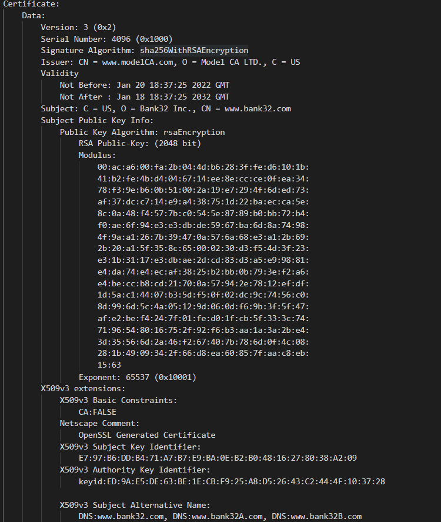
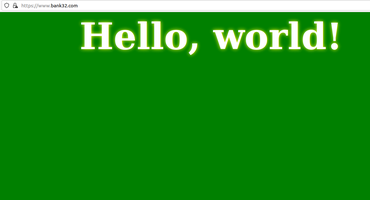
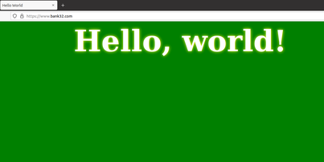

## Logbook 11

#### Task 1

We can verify that the certificate created is a CA through the part that reads "CA: TRUE" and that it is self-signed because the issuer and the subject are the same.

Opening the certificate, we can observe that the critical values for the calculation of the key are shown, most in hexidecimal format with each byte separated by colon.


Modulus:
```
    00:9d:50:fa:8f:a5:3f:0b:6b:40:aa:c1:62:30:40:
    77:5e:22:9a:cd:99:6d:5e:87:06:18:56:d9:96:13:
    8d:39:2c:6e:fa:f7:21:c8:4b:42:d9:9e:5b:9a:80:
    3a:c9:55:92:de:62:ff:47:e0:f2:9a:0f:58:a2:f5:
    7c:bd:cf:d9:1a:e3:17:4d:39:5e:a0:f0:e9:dd:8b:
    3c:88:1b:62:94:9b:18:d0:a6:28:50:d7:81:fb:10:
    96:6e:77:eb:25:c3:09:a5:25:47:73:b7:02:0a:05:
    71:a1:51:e5:2a:7f:77:d4:b1:85:fe:b2:09:6e:cb:
    79:62:58:31:12:6f:fd:cd:c9:d0:fb:bb:70:29:68:
    41:11:53:48:08:89:c5:ec:8e:d3:0f:07:9a:0a:19:
    82:d0:af:19:1d:f3:88:53:90:2b:3a:d0:ef:0f:64:
    03:7d:e1:96:01:70:9d:ae:b3:ea:71:71:39:c6:f8:
    11:75:e7:7f:cb:1b:96:76:1d:ac:d5:e5:45:51:1c:
    6d:43:e1:72:b9:90:62:af:e5:f5:39:e7:11:61:89:
    dc:c0:aa:15:f7:4e:e7:fa:b0:54:42:7a:a7:e1:6b:
    0f:05:4d:16:8e:a7:c7:82:e2:e5:7b:0b:3b:81:11:
    21:b7:02:1d:ce:e7:10:95:07:ca:b4:46:43:eb:65:
    33:89:5a:1a:86:49:9b:d4:38:c2:b9:66:7d:24:71:
    09:4d:b5:69:e9:12:0c:eb:d0:a1:9f:8e:b6:75:46:
    77:e4:42:e4:99:4d:e7:4e:8e:93:79:ab:c7:2c:2a:
    3f:40:3f:83:f8:cc:32:e8:53:ec:2d:9c:89:a0:2b:
    fc:e3:06:31:00:ff:e7:e3:d1:25:bb:0d:b5:1c:52:
    f0:fa:a3:a6:0d:7e:f2:bf:da:cb:80:59:14:72:75:
    b7:b6:40:51:b9:e5:11:9e:79:62:f9:dc:e3:b1:3e:
    3f:f5:ff:a5:77:ae:2c:f4:c8:1f:7c:eb:3e:8a:92:
    f7:5d:e4:4c:4a:76:85:61:c2:04:f2:dc:7a:1e:47:
    9b:31:72:39:19:d3:60:c8:a6:2d:2c:ed:93:10:c6:
    49:6b:48:e3:0b:15:cd:b5:97:3a:b8:01:01:22:ae:
    4e:f3:aa:42:14:72:cb:7f:94:c3:cf:b4:d8:45:7a:
    04:c4:41:14:0e:55:fb:f8:9f:94:8e:f2:5b:5f:38:
    dc:20:25:f6:c7:3c:de:fc:e8:60:5a:40:ce:6c:c2:
    48:a3:3f:e1:0d:ed:1f:90:38:84:93:62:10:9e:7e:
    70:66:39:0a:de:25:8a:56:da:91:2a:c3:3e:88:ae:
    58:59:3e:13:a6:fd:de:32:88:b6:b9:61:d9:bb:58:
    7a:10:95
```

Public exponent: 65537 (0x10001)

Private exponent:
```
    17:66:d5:6f:0a:e0:de:fc:fc:68:aa:4d:c5:e9:c1:
    18:02:c3:ce:73:d5:5e:2b:6d:cf:af:13:bd:0c:79:
    84:98:c4:85:96:bf:b2:c0:e7:57:e2:03:b4:6f:00:
    cf:b4:68:1d:a6:d2:5c:c9:ec:ac:d8:3d:92:38:3c:
    6f:2b:fd:1a:cf:cf:46:90:93:30:13:c6:66:4b:71:
    1c:ba:1e:27:07:0f:60:f2:66:aa:e7:f4:10:f9:fd:
    b6:bf:25:fe:bf:0d:af:40:65:69:a4:3e:ac:68:f4:
    e7:4f:7c:6c:9e:fb:9f:6b:2d:08:9f:49:61:ee:e8:
    c6:a5:61:df:61:43:7b:1a:5b:79:26:ff:df:58:ff:
    dc:e8:eb:9d:41:89:6c:d0:2e:3b:5d:21:20:01:7d:
    81:37:9a:df:e6:bb:4f:da:f1:63:55:73:4a:71:d1:
    47:27:88:9d:fc:37:a8:a6:60:e8:b1:34:2c:11:f8:
    de:f6:29:ff:77:c2:21:1d:f6:f8:f6:9b:22:1e:bd:
    6e:4c:9a:39:5a:6e:23:c6:6c:7d:49:8f:3f:58:37:
    bb:7d:51:b9:31:46:b6:f7:06:01:c1:a7:39:94:28:
    6e:dc:71:cf:94:cb:cb:ff:9e:ad:78:15:48:f4:d8:
    74:15:df:83:48:c2:21:b9:40:01:23:36:b5:4c:9f:
    a6:c2:3c:34:2a:ca:bd:8a:8d:03:d9:6b:79:97:fb:
    e8:fa:ca:82:7b:ef:39:db:92:b6:46:4e:44:34:29:
    b9:9a:a9:e3:b6:4f:3d:c0:cb:96:d3:b2:3b:bb:5c:
    df:64:8a:98:a4:9a:26:3e:5d:a5:ae:e5:a6:6a:98:
    1a:03:fa:aa:72:df:31:a3:0a:c5:98:36:26:19:9f:
    17:7a:a1:b2:82:72:18:68:47:40:4d:fb:19:7b:4d:
    01:ad:71:ea:fe:9f:25:1d:3a:25:96:46:46:69:35:
    4c:c6:2f:a3:ca:b7:cb:30:bd:1e:e8:b4:82:3a:ce:
    96:74:c7:e0:d9:9b:1e:53:6d:79:90:c3:3d:11:21:
    85:85:13:c7:86:51:86:86:a0:83:63:8a:ac:ff:81:
    dd:e6:14:dc:b6:38:91:74:10:03:06:db:be:1a:ce:
    6c:65:6a:87:ce:08:40:2a:8d:56:c7:6e:ef:e0:ed:
    a7:72:0a:73:fa:80:3e:0e:33:56:3f:67:4d:67:2f:
    7c:16:a9:7b:8f:cc:01:b2:f3:d4:d0:39:0f:a1:a0:
    57:bd:40:8f:43:27:30:66:73:cd:65:2e:03:a0:b8:
    86:74:c4:95:c7:0a:f0:11:f0:eb:ba:06:d7:c8:f2:
    46:75:ed:fc:e1:48:f9:7b:a6:a9:c4:db:7e:1a:56:
    71:fd
```

P (Prime 1):

```
    00:d1:04:b8:3a:9e:ff:7c:7b:91:a1:87:53:d8:07:
    bd:fb:73:4f:1b:9f:35:92:8d:05:0a:3c:0c:2e:7f:
    f8:65:ab:1d:63:ab:0e:a6:58:26:c6:09:cf:53:a1:
    64:41:04:2b:8e:a6:5e:2a:6c:f9:fc:7a:b2:d2:b3:
    e6:9e:76:60:08:a8:29:05:3c:da:a9:67:d4:de:d1:
    38:e0:6d:58:69:01:35:cc:37:7b:1f:35:69:7e:19:
    96:6d:97:58:36:70:9c:c4:f3:72:16:b4:88:36:7f:
    19:1a:cc:5d:62:44:dc:f3:b5:a9:76:09:ab:fd:8c:
    33:6a:86:14:d1:61:b5:f8:2b:95:dd:99:a1:e6:a1:
    ae:bf:ab:ba:d3:96:72:50:fa:3d:3f:a0:03:13:9a:
    d0:21:90:fd:f9:b8:85:b0:28:c5:fb:ab:b5:58:a2:
    e1:44:b9:55:d3:75:70:59:be:74:04:1c:04:9c:6e:
    4a:bd:2d:af:88:f6:1c:67:07:6f:da:90:4a:3c:80:
    e1:ef:8c:40:86:c1:07:06:ce:5d:3f:e4:b9:52:8e:
    67:cf:5d:f1:ca:68:7e:04:4f:84:e8:d3:11:15:da:
    f5:88:ce:b7:5d:51:5f:a7:b4:8d:32:d0:37:c5:80:
    29:b1:13:ae:03:ff:c7:d7:0e:ca:a8:03:22:8e:67:
    ab:83
```

Q (Prime 2):

```
    00:c0:ad:3b:08:b0:17:d8:98:cf:87:01:a8:47:24:
    ab:b9:fa:08:bc:f4:7a:a3:bd:a3:2e:ba:5d:44:08:
    78:7f:6a:00:41:71:6c:34:8e:d6:72:b2:6d:78:91:
    21:4e:ab:26:91:95:64:9f:d2:c1:c0:5f:e0:2f:c1:
    7f:cd:ba:4d:6b:e6:b9:66:0a:35:78:c3:b3:11:c7:
    57:00:15:e2:53:8e:c8:5c:28:14:87:6e:15:1d:5d:
    8d:c2:17:24:b8:78:f1:34:4f:86:80:ae:14:2a:f9:
    73:a2:7a:fd:9c:b7:7d:69:87:d9:73:11:8d:7c:bd:
    67:0b:b6:ac:81:df:cb:05:c0:56:a9:32:d6:c0:c0:
    9d:c1:3f:dd:5a:fc:a7:5d:49:26:aa:23:e1:9a:a8:
    95:02:a4:90:0f:c9:41:1c:ad:d1:2c:92:23:9c:66:
    7a:dc:0b:1d:82:0e:49:c4:6b:ea:e3:22:50:77:8e:
    a3:bf:75:4c:50:cf:c0:7a:ca:ec:72:29:a5:65:e5:
    0b:29:38:13:9c:43:5d:de:46:21:c3:cf:ae:96:32:
    9e:dd:fa:7f:1d:1c:2e:2d:e6:55:f3:8b:6a:69:7f:
    b1:68:cf:22:b8:c3:6d:49:ff:0c:c5:da:6e:02:9a:
    63:2b:b9:72:13:6c:38:d6:77:a8:42:53:83:2e:bc:
    20:07
```

We can also verify that this key is valid because `modulus = prime_1 * prime_2`


#### Task 2

We added `www.bank32A.com` and `www.bank32B.com` as per the example of the two alternative names and by opening the file created with the command

```bash
openssl req -in server.csr -text -noout
```

#### Task 3

This part revolves around generating a certificate with the command 

```bash
openssl ca -config openssl.cnf -policy policy_anything \
-md sha256 -days 3650 \
-in server.csr -out server.crt -batch \
-cert ca.crt -keyfile ca.key
```

We can verify that the alternative names are still included by running the command 

```bash
openssl x509 -in server.crt -text -noout
```

as shown in the images.




#### Task 4

After setting up the server and running the command 

```bash
service apache2 start
```

in the docker container, we can access the website which has only a simple "Hello World" message.

We can browse the website, but not without risk.



By adding the CA "modelCA" already existent in Docker to the "Authorities" tab we can fix the problem.



Note the padlock without warnings.


#### Task 5

We can simulate a man-in-the-middle attack by changing the DNS file at "/etc/hosts" we can access `www.example.com` as if it were the bank site.

But we cannot access the website without risk and the communication isn't secure because only "bank32A" and "bank32B" were added as alternative names to the certficate. 


#### Task 6

We can fix this problem and correctly complete the experiment by adding `www.example.com` to the certificate and then changing the configuration file to point to the "server.crt" and "server.key" by sending the file through Docker's shared folder, which should work since we also added the "ca.crt" file, the entity that signed that certificate, which should now be recognised by the browser.