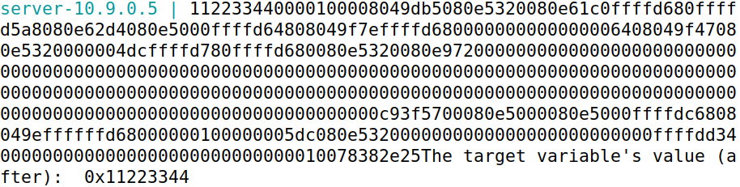
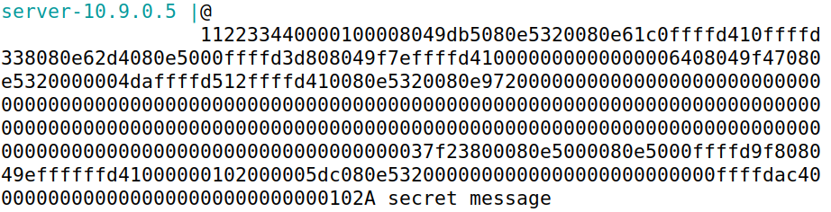
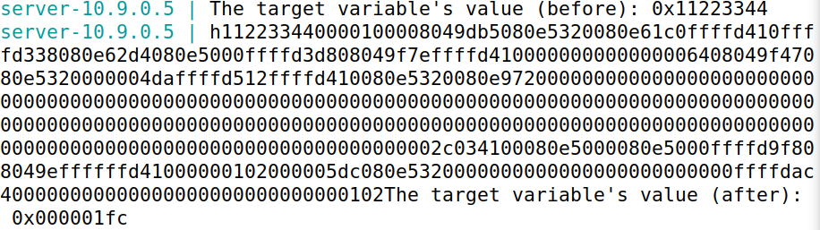
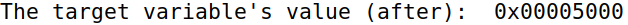
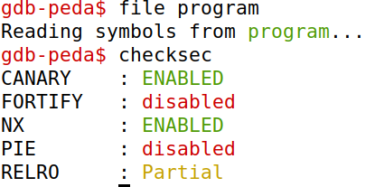
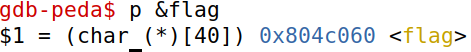
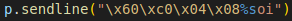

## Logbook 6

### Task 1

Task 1 asks us to crash the program using a given input so that printf() crashes when called in myprintf().

The printf(msg) function has a format-string vulnerability once it can print information on the stack and given the right permissions write to memory.

Inputting something like "%x" a few times should reveal some of the  values that the stack contains. We believe this happens because in this case the function can't verify a normal usage like "printf("%x", hex_number)" containing variables for optional arguments and when receiving only a format string like "print("%x")", simply assumes that the next value in the stack has to fill the value being requested. 

Inputting "printf("%s")"", for example, crashes the program as it will try to find the string pointed to by the next value in the stack (interpreted as an address), which is very likely a random value, which makes it so that the memory is likely not accessible in that place or the value is unreadable and it crashes the program.

### Task 2

#### Task 2.A

In this Task we needed to figure out how many "%x" we needed so the server program would print out the first four bytes of our input.

On the first try we inserted "%.8x" a hundred times, and we realized that more or less in the middle as there was an address that starting to repeat itself. So, we took that hexadecimal (0x78382E25), and we saw that it correspond to the characters "%.8x" our original string, where

- x was equal to 78 in hexadecimal
- 8 was equal to 38 in hexadecimal
- . was equal to 2E in hexadecimal
- % was equal to 25 in hexadecimal

Then, through binary search, we discovered that we needed to put "%.8x" exactly 64 times, and the last address that showed up corresponded to the characters "%.8x", exactly the same as our input.

This opens up some possibilities because it reveals the location after which the user can control the program solely through its input.

 

 

#### Task 2.B

In this Task, we had to discover a secret message (string) that was stored in the heap area. In the server printout, we discovered the address of the string in the stack: 0x080B4008.

Once we discovered the address, we sent it to the server as a set of bytes for example "\x08\x40\x0b\x08" concatenated with "'%.8x' * 63" and "%s", so we could see the value of the string that was stored in the heap. The 63 '%.8x' prints the addresses until we reach our input which corresponds to "\x08\x40\x0b\x08" which is going to be 'consumed' by '%s' that prints the string in that address. This string is the secret message "A secret message".

 

 

### Task 3
#### Task 3.A

In this Task, we had to modify the value of the variable 'target'. From the prints of the server we know that the target's variable address is 0x080E5068. With this information we can now add this address to the stack and go through the addresses until we reach the target's address. We do this by reading 63 addresses with '%.8x' and then changing the value of the target variable with '%n. This puts the number of previous characters in the variable in the target's address. The value of the target variable is then modified.

 

 

#### Task 3.B

In this Task, we also have to modify the value of the target variable, but this time, we have to modify it to a specific value: 0x5000, which is 20480 in decimal. On our first approach we figured we could just add the number of characters we needed to the string and this would successfully change the value of the target's variable to the desired one. This was not possible because the buffer's size is limited. The alternative was then to print addresses we were alredy printing with extra zeros. Our string, at the moment, was "\x68\x50\x0e\x08" + "%.8x" * 63 + "%n", but the number of characters before the '%n' was only 508, so we needed to increment this number without exceeding the buffer's size. We padded the addresses that were being printed and got "\x68\x50\x0e\x08" + "%.325x" * 63 + "%n", but this only gave us 20479 characters, so we added a single character and our string became "\x68\x50\x0e\x08" + "%.325x" * 63 + "A" + "%n". This changes the value of the target variable to 0x5000.

 

 

### CTFs

#### CTF 7.1

Running checksec on program we can verify that the program's addresses are static, which, in this case, causes a format string vulnerability in line 27, where the buffer is printed with "printf()".

 

 

Exploiting this vulnerability we can manipulate the stack in some ways, including reading the stored values. Since the flag, originally stored in the flag.txt file, is read and stored in a global variable and the addresses are static, 
with the help of gdb we can discover the address of the flag with "p &flag", we can read the value stored in that address.

 

 

With that command we conclude that the address is 0x804c060, and, as such, we can input the string "\x60\xc0\x04\x08%s" and read the value stored in the heap, which leads to the flag. This is only possible so directly because the range 
of memory which we can control is immediately available, therefore '%s' will 'consume' the first address we pass on the string.

 

 

We can confirm this by inputting "%.8x" which leads to the result "783872e25", which is the string itself, and not some other value stored in the stack. 

#### CTF 7.2
