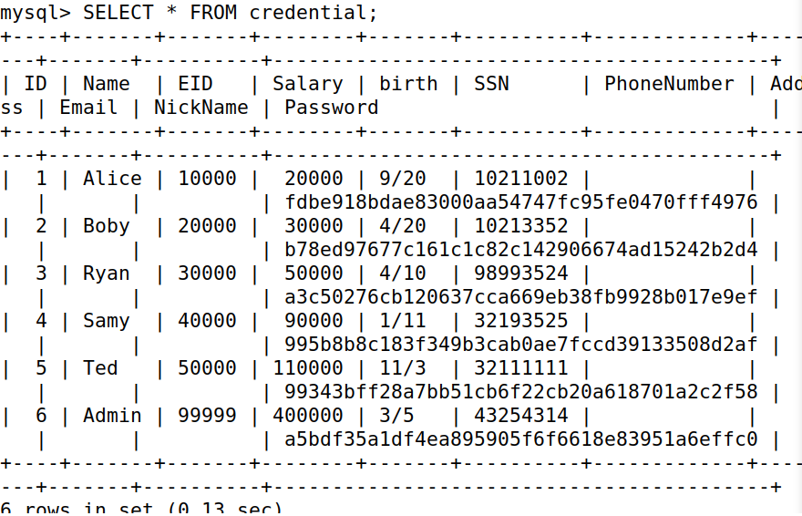
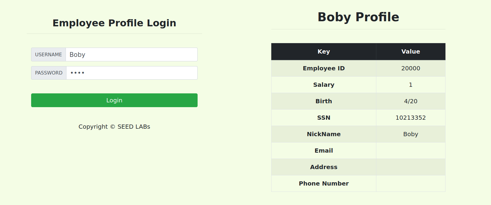
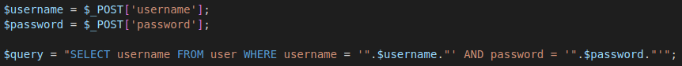
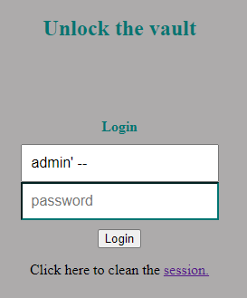
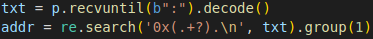

# Logbook 8

## Task 1

As requested, we successfully got a shell on the mysql container using the line "mysql -h 10.0.9.6 -u root -p" and entering the designated password.

We loaded the predefined database "sqllab_users" and got an empty table for "credential" when using "show tables".

We are tasked with printing information about Alice, so using the line "SELECT * FROM credential" we are able to print the entirity of the entries in credential, thus finding the entry related to Alice, as shown below:

 

 

## Task 2

### Task 2.1

The task asked us to login into the admin account, with the detail that we only have access to the name (in this case 'admin'). Given SQL receives and iterates over queries sent to it, we can write **admin'#** to subvert the PHP query and ignore the password check, this is done because we comment the rest of the query with the # and end the current line of the query with the '.

Knowing this we are able to login into the admin account using only its name.

### Task 2.2

In this task, similar to the previous one, we were also asked to login into the admin account, but this time without using the webpage. All we had to do was use 'curl' in the shell which sends an HTTP request to the server. 

We then sent the following line **$curl 'www.seed-server.com/unsafe_home.php?username=admin%27%23** and received information about the page the admin sees after logging in.

It works because, following the principle in the previous task, we used both parameter closing (') and the comment tag (#) to subvert the rest of the query and prevent it from running. But in this case, we had to encode the symbols ' to %27 and # to %23 due to the way HTTP encoding works.

### Task 2.3

We were not able to run any other SQL statements with the original one, this comes from the fact that there is a prevention mechanism [multi_query](https://www.php.net/manual/en/mysqli.quickstart.multiple-statement.php) which prevents the existence of multiple queries within a single statement.

And obviously this mechanism is the reason we are not able to run multiple queries in a single sentence.

## Task 3

### Task 3.1

In this task we were asked to update our salary using the Edit Profile page. We can do this by submitting this line **Alice', salary = '50000** into the nickname form. This will also add an update to the salary column given the id corresponding to the authenticated user, in this case Alice.

### Task 3.2

In this task we were asked to update the salary of Boby, which has user_ID = 2, to 1. 

We were able to do this using the following line 'Boby', salary = '1' WHERE ID='2'#'.

We write this in any of the forms available in the Edit Profile page. First we repeat the same procedure as the last task to change the salary, but this time we refer a different ID by commenting the following code and adding the WHERE condition ourselves.

We are then able to reference any user and alter any column using the ID.

### Task 3.3

In this task we were asked to update the password of the user Boby. In this case we follow the same procedure as last task, writing our SQL code into any of the forms in the Edit Profile page.

In this case the line we used was 'Boby', password = sha1('boby') WHERE ID='2'#'.

Given the encryption of the password uses SHA1 we also need to use that to set the new password. In our example we chose **boby** as the new password thus giving it as argument to the **sha1** function we have to use in the password query.

New password giving us access to Boby's account:

 

 

### CTFs

#### CTF 8.1

In this CTF we are tasked with finding the flag, which is given to us when we successfully login into the 'admin' account.

To achieve this we have to perform a SQLInjection attack. 

To do this we must look at the code and find the vulnerability, which usualy means searching for a input controlled by the user that is able to modify code if given SQL queries. In this case we found it in the query that receives de username.

 

 

After that, all we have to do is input the following line: 'admin' --'

 

 

This line will give us access to the admin account straight away, as we comment the password check with the '--', which means it will always skip the password check, and we can input whatever we want in the password field and we will still have access to the account desired.

Thus we are able to login into the admin account using only the username and retrieving the flag.

#### CTF 8.2

By executing the "program" file we that it is printing the buffer's variable address. We will use the value later.

By using the "expoit_example.py" file provided in earlier CTFs, we can adapt it to work in this week's CTF.

We start by removing the buffer's address which was printed by the program (we will use regex to do that).

 

 

We then pass the buffer address to an array of bytes with the command: "buf = bytearray.fromhex(addr)" and reverse it with "buf.reverse()".

We then transform the shell's hexadecimal code into an array of bytes with the command "shellcode = bytearray.fromhex("31c050682f2f7368682f62696e89e3505389e1b00bcd80")".

We know the frame pointer is in the stack, after the local variables and that it has a size of 32 bits. So, we create a hexadecimal number with eight "0"s in hexadecimal with the command: "fp = bytearray.fromhex("0"*8)".

We then create the final string that will be sent to the exploit with the command: "finalString = b"a"*77 + fp*2 + buf" (b transforms an array into a string, buf is the shellcode, fp is the frame pointer and we multiple "a" by 77 because 100-23=77).

We then send the string to the sheelcode. To do that, we need to put the string after the hexadecimal code refering to the shell ("p.sendline(shellcode + finalString)").

Finally, we enter interactive mode with "p.interactive()" and write "cat /flag.txt" where it will print out the flag.
